# Convert2 🪄

<div align="center">


**[🇪🇸 Español](#-español) | [🇬🇧 English](#-english)**

</div>

---

# 🇪🇸 Español

## 📌 Descripción General

**Convert2** es una suite multifuncional y modular de herramientas para la gestión y conversión de documentos **PDF**, **archivos de Word** e **imágenes**. 

Diseñado con una arquitectura moderna *Single Page Application (SPA)* basada en **Vanilla JavaScript con Single File Components (SFC) cargados bajo demanda (ESM Lazy Loading)**, todo el procesamiento se ejecuta íntegramente en la CPU del dispositivo del usuario mediante **WebAssembly**, **Web Workers** y **HTML5 Canvas**.

> [!IMPORTANT]
> **Privacidad 100% Garantizada:** Tus archivos nunca se suben a ningún servidor externo. Todo el cómputo, renderizado y análisis ocurre de forma local y privada en tu navegador.

---

## 🌐 Acceso Online
Puedes utilizar la plataforma inmediatamente sin registro ni instalación en:  
👉 **[https://cristian-haro.github.io/convert2/](https://cristian-haro.github.io/convert2/)**

---

## 🛠️ Catálogo de Herramientas

```mermaid
graph TD
    Root["Convert2 Engine"]
    Root --> PDF["📄 Documentos PDF"]
    Root --> IMG["🖼️ Edición de Imágenes"]
    Root --> TXT["📝 Texto y Oficina"]

    PDF --> P1["Unir PDF"]
    PDF --> P2["Separar PDF"]
    PDF --> P3["Rotar PDF"]
    PDF --> P4["Imágenes a PDF"]
    PDF --> P5["PDF a Imágenes"]
    PDF --> P6["Firmar PDF"]
    PDF --> P7["Proteger / Desproteger"]
    PDF --> P8["Word a PDF / PDF a Word"]
    PDF --> P9["Organizar PDF"]
    PDF --> P10["Comprimir PDF"]

    IMG --> I1["Convertidor Formatos (.ICO, WebP, etc.)"]
    IMG --> I2["Comprimir Imagen"]
    IMG --> I3["Recortar y Redimensionar"]
    IMG --> I4["Marca de Agua"]
    IMG --> I5["Eliminar Fondo (IA Local ONNX)"]
    IMG --> I6["Limpiar Metadatos EXIF"]
    IMG --> I7["Cuadrar Imagen"]

    TXT --> T1["Extraer Texto (.txt)"]
    TXT --> T2["OCR Local (Tesseract.js)"]
    TXT --> T3["Comparar Textos (Diff Visual)"]
```



### 📄 Documentos PDF
- **Unir PDF:** Combina múltiples archivos PDF en el orden deseado con controles interactivos de reordenación.
- **Separar PDF:** Extrae rangos específicos de páginas hacia nuevos documentos independientes.
- **Rotar PDF:** Corrige la orientación de páginas (90°, 180°, 270°) de forma visual.
- **Imágenes a PDF:** Convierte y compagina archivos JPG, PNG, WEBP, BMP o GIF en un solo PDF.
- **PDF a Imágenes:** Extrae todas las páginas de un documento como imágenes (PNG/JPEG) dentro de un archivo `.ZIP`.
- **Firmar PDF:** Dibuja firmas manuscritas en lienzo interactivo y colócalas con precisión sobre el documento.
- **Proteger PDF:** Cifra con contraseña (RC4 128-bit) o elimina restricciones de documentos protegidos.
- **Word a PDF & PDF a Word:** Conversiones bidireccionales y extracción de contenido editable (`.docx`).
- **Organizar PDF:** Reordena, rota o elimina páginas individuales con vista previa interactiva.
- **Comprimir PDF:** Optimiza el peso rasterizando páginas como imágenes JPEG de alta eficiencia.

### 🖼️ Edición de Imágenes
- **Convertidor de Formatos:** Conversión cruzada entre PNG, JPG, WEBP, GIF, BMP e **iconos de Windows (.ICO)** multirresolución con transparencia.
- **Comprimir Imagen:** Ajusta la calidad de compresión con cálculo en tiempo real del tamaño resultante.
- **Recortar y Redimensionar:** Define márgenes, dimensiones en píxeles y bloquea relaciones de aspecto.
- **Marca de Agua:** Inserta texto personalizado con control de opacidad y posición sobre imágenes.
- **Eliminar Fondo:** Segmentación inteligente de fondo mediante IA local (*WebAssembly + ONNX* vía `@imgly/background-removal`).
- **Limpiar EXIF:** Elimina metadatos confidenciales (geolocalización GPS, cámara, autor) de archivos JPEG/PNG.
- **Cuadrar Imagen:** Añade márgenes difuminados o colores sólidos para adaptar imágenes a formatos cuadrados.

### 📝 Texto y Oficina
- **Extraer Texto:** Obtiene el contenido textual seleccionable de archivos PDF y Word (`.docx`).
- **OCR Local:** Reconocimiento óptico de caracteres multilingüe en imágenes y documentos escaneados (*Tesseract.js*).
- **Comparar Textos:** Comparador visual de diferencias *side-by-side* o unificado en tiempo real (*diff.js*).

---

## 🏗️ Arquitectura Técnica

```
convert2/
├── index.html              # Entrada principal y contenedor SPA
├── style.css               # Loader de hojas de estilo modulares
├── app.js                  # Orquestador del ciclo de vida, Lazy Loading y Global Drag & Drop
├── css/                    # Sistema de diseño desacoplado
│   ├── variables.css       # Tokens de diseño (colores, espaciados, bordes)
│   ├── layout.css          # Estructura general, navegación horizontal y sidebar
│   ├── pdf-tools.css       # Estilos específicos de herramientas PDF
│   ├── image-tools.css     # Estilos de manipulación gráfica y comparadores
│   ├── text-tools.css      # Estilos de OCR y diff visual
│   ├── global-drag.css     # Overlay reactivo de arrastre global
│   └── inicio.css          # Vista de mosaico y panel inicial
└── js/                     # Componentes SFC (HTML template + init logic)
    ├── helpers.js          # Utilidades (formatBytes, showToast, loadScript, dropzone)
    ├── layout/             # Componentes de layout (inicio, privacidad)
    ├── pdf/                # SFCs de herramientas PDF
    ├── image/              # SFCs de herramientas de imagen
    └── text/               # SFCs de herramientas de texto
```

---

## 💻 Desarrollo Local

No se requiere compilación ni empaquetado complejo. Puedes servir el proyecto con cualquier servidor HTTP estático:

```bash
# Opción 1: Con Python
python -m http.server 8000

# Opción 2: Con Node.js (npx serve)
npx serve .

# Opción 3: Con la extensión Live Server de VS Code
# Haz clic derecho en index.html -> "Open with Live Server"
```

Abre tu navegador en `http://localhost:8000`.

---

# 🇬🇧 English

## 📌 Overview

**Convert2** is a modular, client-side toolkit for managing and converting **PDF documents**, **Word files**, and **images**.

Built with a lightweight *Single Page Application (SPA)* architecture using **Vanilla JavaScript with Single File Components (SFC) loaded on demand (ESM Lazy Loading)**, all processing runs locally on the user's CPU leveraging **WebAssembly**, **Web Workers**, and **HTML5 Canvas**.

> [!IMPORTANT]
> **100% Privacy Guaranteed:** Your files are never uploaded to any remote server. All file parsing, rendering, and transformations happen strictly inside your browser.

---

## 🌐 Live Application
Access the app directly without registration or installation:  
👉 **[https://cristian-haro.github.io/convert2/](https://cristian-haro.github.io/convert2/)**

---

## 🛠️ Features Breakdown

| Category | Tool | Description |
| :--- | :--- | :--- |
| **PDF** | **Merge PDF** | Combine multiple PDF files into one with drag-and-drop reordering. |
| **PDF** | **Split PDF** | Extract custom page ranges into separate documents. |
| **PDF** | **Rotate PDF** | Correct page orientation (90°, 180°, 270°) visually. |
| **PDF** | **Images to PDF** | Convert and assemble JPG, PNG, WEBP, BMP into a single PDF. |
| **PDF** | **PDF to Images** | Export all pages as high-resolution images bundled in a `.ZIP`. |
| **PDF** | **Sign PDF** | Draw digital signatures on an interactive canvas and stamp them. |
| **PDF** | **Protect PDF** | Encrypt with 128-bit passwords or remove password protections. |
| **PDF** | **Word & PDF Converter**| Convert `.docx` to PDF and extract editable text back to Word. |
| **PDF** | **Organize PDF** | Visual thumbnail organizer to reorder, rotate, or delete pages. |
| **PDF** | **Compress PDF** | Reduce file size via optimized JPEG rasterization. |
| **Image**| **Format Converter** | Convert between PNG, JPG, WEBP, GIF, BMP, and multi-size Windows `.ICO`. |
| **Image**| **Compress Image** | Downscale and compress images with real-time size estimation. |
| **Image**| **Crop & Resize** | Pixel-perfect cropping and aspect-ratio locked resizing. |
| **Image**| **Watermark** | Apply customized text watermarks with opacity controls. |
| **Image**| **Background Removal**| 100% local AI-powered background remover (*Wasm + ONNX*). |
| **Image**| **Clean EXIF** | Strip private camera and GPS metadata from photos. |
| **Image**| **Square Image** | Add blurred or solid padding for square aspect ratio. |
| **Text** | **Extract Text** | Extract raw selectable text from PDF and Word documents. |
| **Text** | **Local OCR** | Client-side Optical Character Recognition via *Tesseract.js*. |
| **Text** | **Diff Checker** | Real-time visual comparison between two text snippets. |

---

## 🤝 Conventional Commits Specification

This project follows the [Conventional Commits v1.0.0](https://www.conventionalcommits.org/) standard:

```text
<type>(<scope>): <short summary in imperative mood>

[optional body explaining rationale]

[optional footer for breaking changes or issue references]
```

### Supported Scopes
- `pdf`: Changes related to PDF manipulation modules (`js/pdf/*`).
- `image`: Changes related to image editing & AI segmentation (`js/image/*`).
- `text`: Changes related to OCR and diff utilities (`js/text/*`).
- `ui`: Stylesheet, layout, responsive design, and CSS variables (`css/*`).
- `core`: Main entry point, router, lazy loading, and shared helpers (`app.js`, `js/helpers.js`).
- `docs`: Documentation and README updates.

---

## 🧪 Cross-Platform QA & Compatibility Matrix

| Platform | Browsers Tested | Core Engine APIs |
| :--- | :--- | :--- |
| **Windows 10 / 11** | Chrome, Edge, Firefox | WebAssembly, OffscreenCanvas, Drag-and-Drop |
| **macOS (Sonoma+)** | Safari 17+, Chrome, Firefox | Wasm Heap Allocation, High-DPI Canvas |
| **Linux (Ubuntu/Fedora)**| Chrome, Firefox | Web Workers multithreading, Tesseract Wasm |
| **iOS / iPadOS** | Mobile Safari, Chrome iOS | Touch event canvas signing, viewport scaling |
| **Android 11+** | Chrome Mobile, Firefox Mobile | File picker integration, memory bounds |

---

## 📄 License

Distributed under the **MIT License**. See `LICENSE` for more information.
